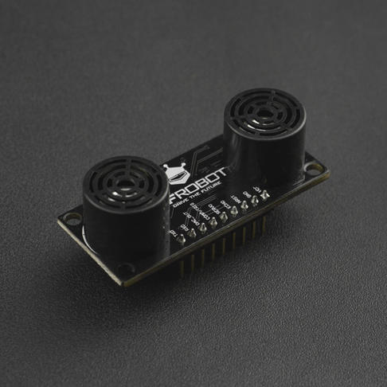

# DFRobot_Sensor
- [English Version](./README.md)

数据手册上抄一下芯片的描述

这里写模块介绍，做到读完这段，就能对模块有初步了解，让客户懂的用这个模块能干什么（数据手册通常比较官方，这里你可以举例子，更场景化）<br>
这个模块的优点，告诉用户为什么要购买这个模块。一些关键术语，我们要在readme中有解释

这里需要显示拍照图片，可以一张图片，可以多张图片（不要用SVG图）




## 产品链接（链接到中文商城）

    SKU：产品名称

## 目录

- [DFRobot_Sensor](#dfrobot_sensor)
  - [产品链接（链接到中文商城）](#产品链接链接到中文商城)
  - [目录](#目录)
  - [概述](#概述)
  - [库安装](#库安装)
  - [方法](#方法)
  - [兼容性](#兼容性)
  - [历史](#历史)
  - [创作者](#创作者)

## 概述

这里填写当前Arduino软件库完成了基础功能，特色功能

## 库安装

使用此库前，请首先下载库文件，将其粘贴到\Arduino\libraries目录中，然后打开examples文件夹并在该文件夹中运行演示。

## 方法

```C++
  /**
   * @fn begin
   * @brief 初始化函数
   * @return 返回0表示初始化成功，返回其他值表示初始化失败
   */
  int begin(void);
  
  /**
   * @fn getSoundStrength
   * @brief 获取声音强度值
   * @return 返回声音强度，单位是DB
   */
  uint16_t getSoundStrength(void);

  /**
   * @fn getLightStrength
   * @brief 获取光线强度值
   * @return 返回光线强度，单位是流明
   */
  uint16_t getLightStrength(void);
  
  /**
   * @fn switchMode
   * @brief 切换模式
   * @return 返回0操作成功, 返回其他值操作失败
   */
  uint8_t switchMode(uint8_t mode);

  /**
   * @fn setLED
   * @brief 设置LED灯的颜色
   * @note  设置颜色后，0.2秒后生效
   * @param r 红色通道颜色值，范围0-255
   * @param g 绿色通道颜色值，范围0-255
   * @param b 蓝色通道颜色值，范围0-255
   */
   void setLED(uint8_t r, uint8_t g, uint8_t b);

  /**
   * @fn setLED
   * @brief 设置LED灯的颜色
   * @note  设置颜色后，0.2秒后生效
   * @param color rgb565格式的颜色值
   */
   void setLED(uint16_t color);
```

## 兼容性

主板               | 通过  | 未通过   | 未测试   | 备注
------------------ | :----------: | :----------: | :---------: | -----
Arduino uno        |      √       |              |             | 
Mega2560        |      √       |              |             | 
Leonardo        |      √       |              |             | 
ESP32           |      √       |              |             | 
micro:bit        |      √       |              |             | 


## 历史

- 2019/06/25 - 1.0.0 版本
- 2021/09/30 - 1.0.1 版本

## 创作者

Written by Alexander(ouki.wang@dfrobot.com), 2019. (Welcome to our [website](https://www.dfrobot.com/))


